*Room description -*

The city forgot to close it's gate!

*Kudos to the room creators - Dex01, strategos & l000g1c*
*Writeup written by T3chyy*

# Red: Exploit the Server!

## Enumeration

We start off with an Nmap scan and we find 3 ports open, 22 (SSH), 80 and 50000.

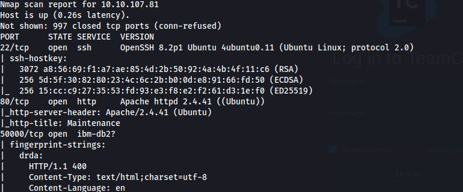

### Port 80

When we go to Port 80, we get a down for maintenance page. Usually when I see this I begin performing enumeration on the directories. Unfortunately, I couldn't find any extra directories. There's also nothing interesting in the source code either, so we move onto another port.

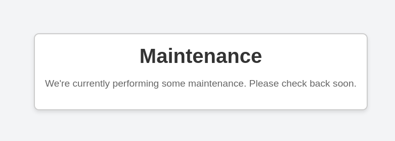

### Port 50000

We find a JetBrains TeamCity instance running on port 50000 running Version 2023.11.3.

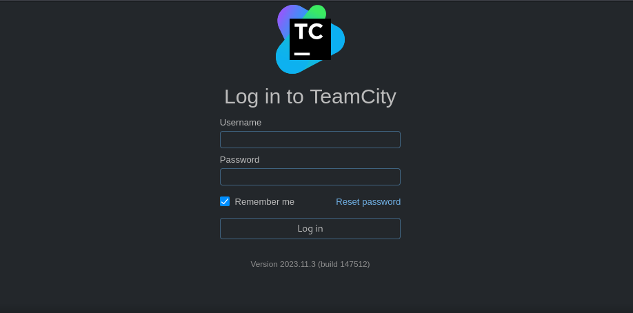

We search on Google for known vulnerabilities, and it looks like we have 2:

- CVE-2024-27198
- CVE-2024-27199

Both of these are authentication bypass vulnerabilities, the one we're gonna be abusing is **CVE-2024-27198**, which has a 9.8 CVSS score due to it being able to turn into unauthenticated RCE. This CVE also has it's own module built into Metasploit.

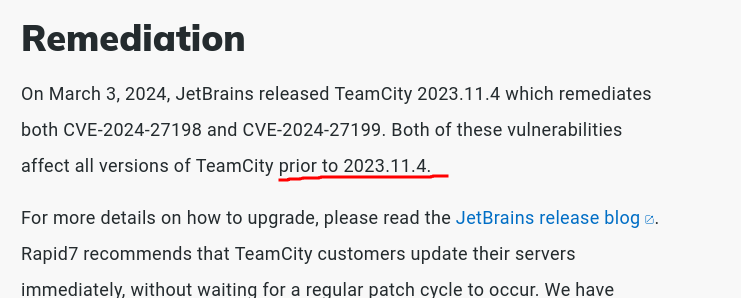

## Exploitation

Launching Metasploit, we search for exploits that can be used against TeamCity, and we find that the third one has the closest disclosure date and CVE we're looking for, so we select it using `use 3`

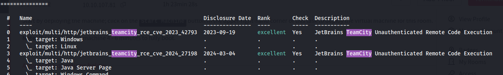

In our options for the exploit, we set the RHOST to be our target IP and the RPORT to 50000, the port that TeamCity is running on, and then we set the LHOST to the IP of the attacker machine. LPORT doesn't need to be changed.

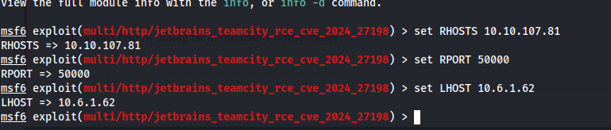

With our fingers crossed, we run the exploit using `exploit` and... bam it worked!

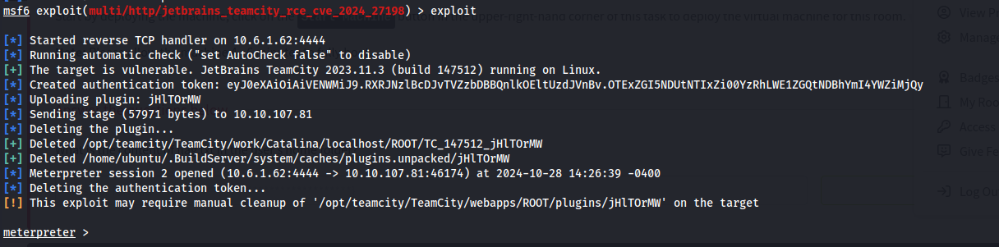

We can now enter onto a shell using ``shell`` and then go to the `home` folder and cat the `flag.txt` that we need to submit.

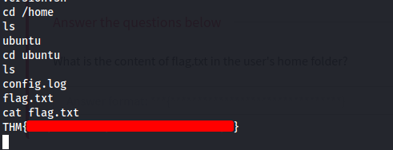

# Blue: Let's Investigate

Now, we switch gears and we go to the blue side, where we use Splunk to inspect logs for suspicious activity and to answer the remaining questions.

On Splunk, navigate to the `Search & Reporting` section.

### What is the name of the backdoor user which was created on the server after exploitation?

Find this by searching the source for `/var/log/auth.log` for `useradd` using the following Splunk query: `source="/var/log/auth.log" *useradd*`

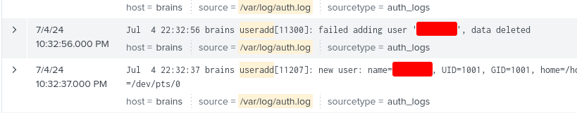

We should find the answer on the 2nd or 3rd rows. It is also here we determine that the date of compromise was July 4th, 2024.

## What is the name of the malicious-looking package installed on the server?

I found the answer to this question by first searching on Google to find the location where package information is logged, which is `/var/log/dpkg.log`.

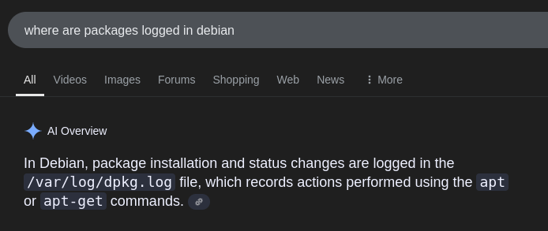

Searching with the query `source="/var/log/dpkg.log"` and filtering the results to a date range between July 4th - July 5th 2024, we found the name of the malicious package:

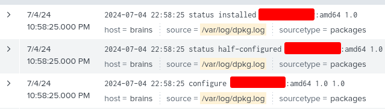

## What is the name of the plugin installed on the server after successful exploitation?

This question refers to our plugin that was created during exploitation to gain initial access to the box. We can find this in the TeamCity log located at `/opt/teamcity/TeamCity/logs/teamcity-activities.log`. 

Using the query `source="/opt/teamcity/TeamCity/logs/teamcity-activities.log" "plugin_uploaded"`, We find the answer to our final question.

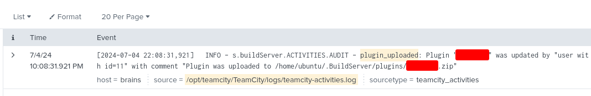